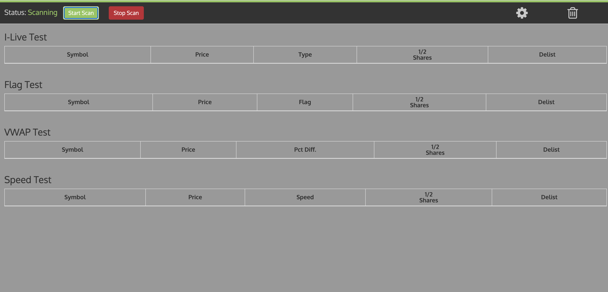

# Stock Scanner
Stock Scanner using the Trade King API. Currently set up to scan 7500 stocks from the NYSE, AMEX, and NASDAQ.


## Installation

1. Clone repo.
2. Install [Node.js](https://nodejs.org/en/download/) **IMPORTANT-> Use Node version 6.9.4**
3. Run `npm i` in your terminal.
4. Sign up with tradeking and get a stock trading account.
5. Follow the steps in the "Getting Set up" section [TradeKing Getting Started](https://developers.tradeking.com/documentation/getting-started)
6. Add the file "tk-creds.json" to the server/json folder. with your keys and tokens.
 ```
{    
    "consumer_key": "yourconsumerkeygoeshere",
    "consumer_secret": "yourconsumersecretgoeshere",
    "access_token": "youraccesstokengoeshere",
    "access_secret": "youraccesssecretgoeshere"

}
```

## Basic Usage

* Run `gulp serve` in your terminal.
* Now you can view the app in localhost:3000 in your browser and start scanning

## Built Using

* Gulp
* Node
* Angular 1
* Bootstrap 3
* OAuth 1a

 
